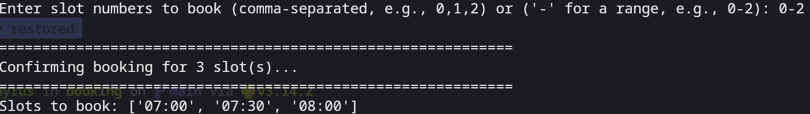

## Setup environment
`pip install -r requirements.txt && touch .env`
## Edit .env to include username
USERNAME = "" 
PASSWORD = ""
## To run script
`python .`

## Example
1. Change DATE = "" to desired date to book (LINE 25)
1. run program and select first option
    
2. confirm room
3. select time slot (',' for different slots, '-' for range)
    