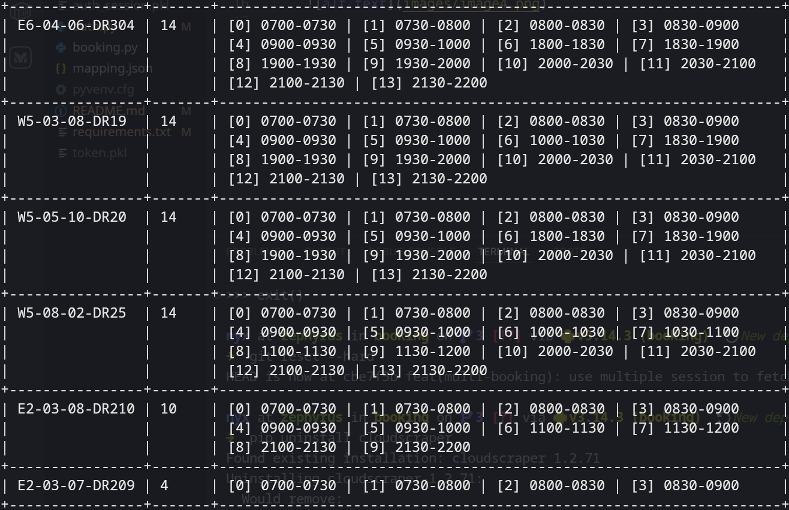
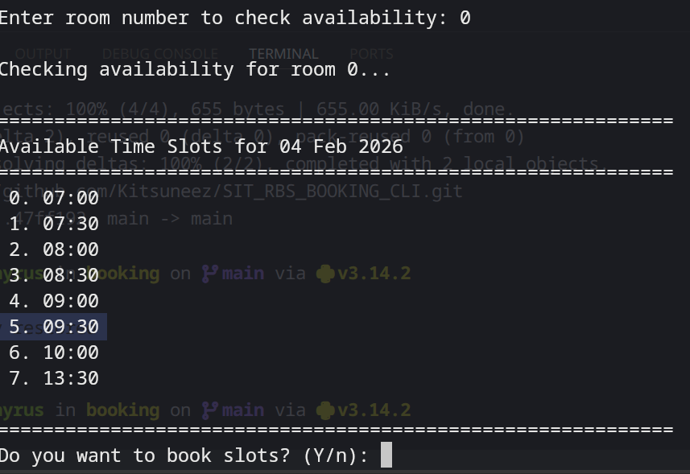

## Setup environment
`pip install -r requirements.txt`
## Add username and password for login into .env
USERNAME = "" 
PASSWORD = ""
## To run script
`python .`

## Example
1. run program and select first option
    
2. choose room
    
3. confirm room (y is default, press enter if yes)
    
4. select time slot (',' for different slots, '-' for range)
    
