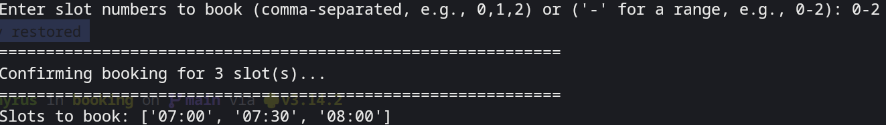

## Setup environment
`pip install -r requirements.txt`
## Add username and password for login into .env
USERNAME = "" 
PASSWORD = ""
## To run script
`python .`

## Example
1. Change DATE = "" to desired date to book (LINE 28)
2. run program and choose room
    
3. select time slot (',' for different slots, '-' for range)
    
