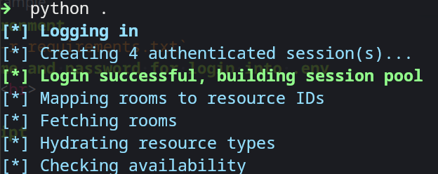
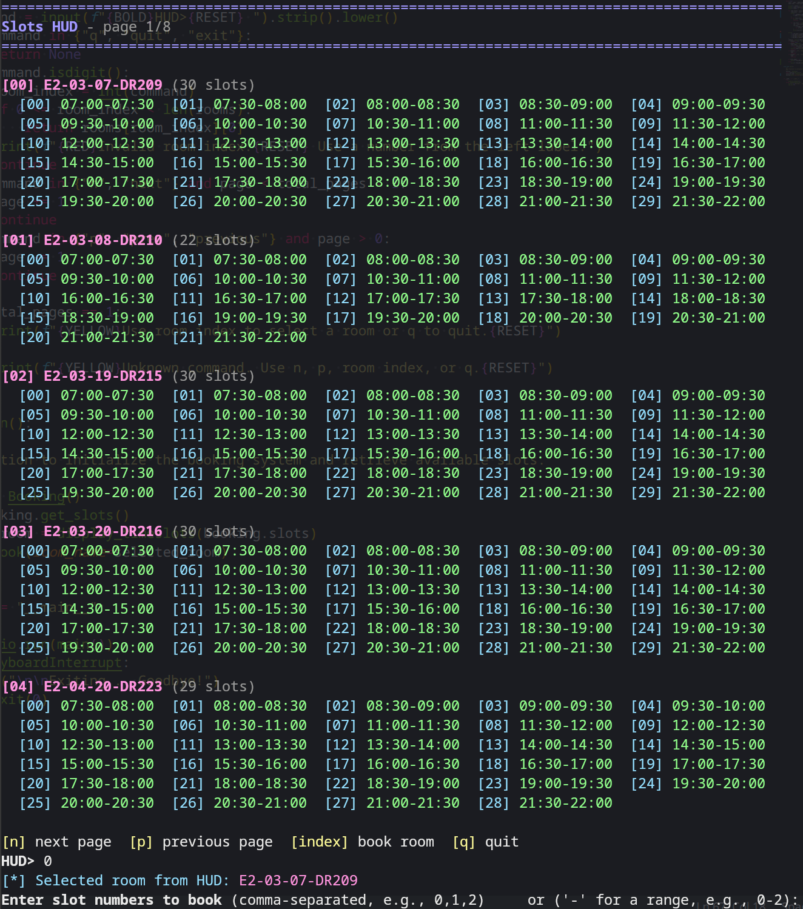

## Setup environment
`pip install -r requirements.txt`
## Add username and password for login into `.env`
USERNAME = "" 
PASSWORD = ""
## To run script
`python .`

## Demo

## Example
1. Set `DATE`, `DEFAULT_SLOT_START_TIME`, and `DEFAULT_SLOT_END_TIME` in `constants.py` to your desired booking date and time
2. run program and program will login using your credentials and fetch rooms

3. navigate through the pages using n and p, enter the room number to select the room

4. Select time slots to confirm booking*

5. The system will confirm the booking when it is successful

*Note: You can only select timeslots using commas OR a range using a dash. For example, "0,2,4" or "0-2". You cannot mix both formats in the same input.

Confirmation of booking may take a while, so please be patient after confirming the booking. If you encounter a timeout error, please try again as it may be due to network issues or server response time.